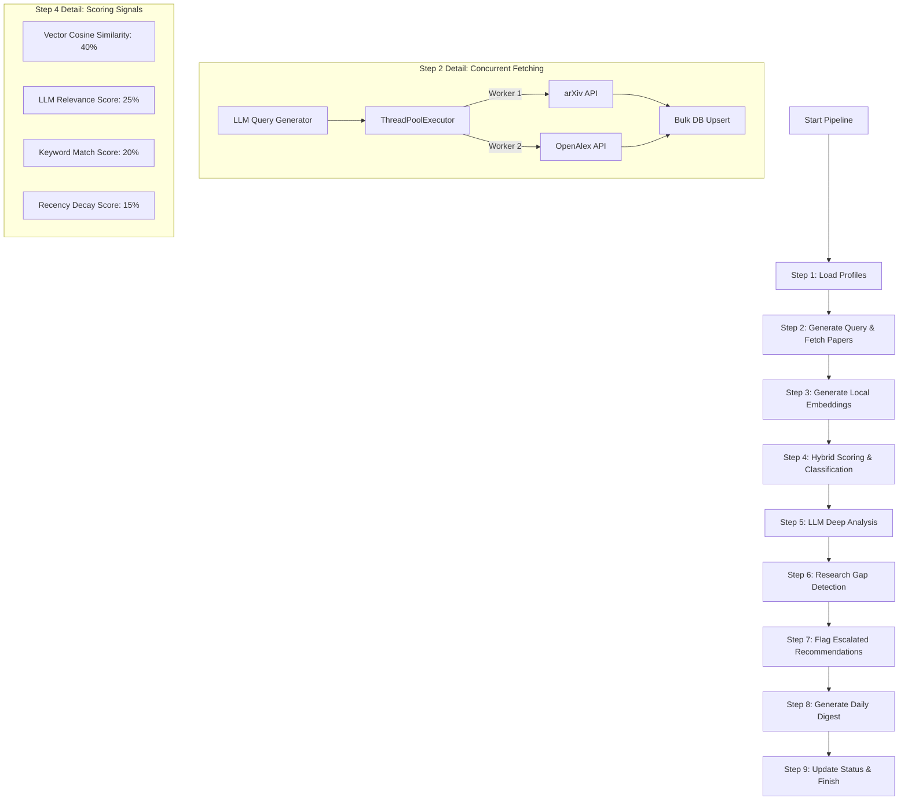

# 🧠 Research Paper Screening Agent: Architecture & Pipeline Deep-Dive

This document provides a comprehensive, production-grade explanation of the **Research Paper Screening Agent** pipeline. It is designed to serve as a thorough technical reference for code maintainers, system architects, and for **technical interview preparation**. 

---

## 📌 Architectural Overview

The agent is a semi-autonomous, multi-stage pipeline designed to retrieve, filter, score, analyze, and summarize academic literature based on user-defined research profiles. It combines **vector search**, **heuristics (keywords & recency decay)**, and **Large Language Models (LLMs)** into a hybrid scoring engine.



### Execution Triggers
1. **User-Triggered Mode (`POST /agent/run`)**: Initiated via the frontend dashboard. Runs asynchronously using FastAPI's `BackgroundTasks` for the **calling user's profile only**. Optimized for low latency (~60-90 seconds) by restricting database queries to a single `user_id`.
2. **Scheduled Mode (`POST /agent/run-all`)**: Triggered daily via a GitHub Actions cron job at 7 AM UTC. Runs for **all user profiles** in the database. Secured via an `X-Agent-Secret` token header.

---

## 🗄️ Core Data Models & DB Schema (Supabase + pgvector)

The backend utilizes **Supabase (PostgreSQL)**. Semantic vector search is enabled by the `pgvector` extension.

### 1. Vectors & Search Optimization (`papers` table)
* **Embedding Column**: `embedding VECTOR(384)`.
* **Dimension Count**: 384 dimensions, matching the output vector space of the `all-MiniLM-L6-v2` transformer model.
* **Vector Index**: 
  ```sql
  CREATE INDEX IF NOT EXISTS papers_embedding_idx
  ON papers USING ivfflat (embedding vector_cosine_ops)
  WITH (lists = 100);
  ```
  * **IVFFlat (Inverted File Flat)**: An approximate nearest neighbor (ANN) index. It partitions the 384-dimensional vector space into 100 clusters (centroids) using k-means. During query execution, instead of performing a brute-force $O(N)$ scanning of all papers, PostgreSQL maps the query vector to the closest centroids and searches only within those clusters, achieving $O(\log N)$ query complexity.

### 2. Entity Relational Mapping (ERD)
* **`users`**: Custom credentials and registration metadata.
* **`user_profiles`**: Has a `1:1` relationship with `users`. Stores interests, keywords, preferred venues/domains, and excluded topics as text arrays (`TEXT[]`).
* **`papers`**: Shared, deduplicated global repository of papers. Deduped by a unique `external_id` (e.g., `arxiv:2403.01234` or `oa:W43891240`).
* **`recommendations`**: A junction table linking `user_profiles` and `papers` (`N:M` relationship). Stores individual scoring signals, final score, relevance classification, escalation flags, and LLM-generated deep analysis JSON.
* **`research_gaps`**: Captures detected research gaps per profile.
* **`daily_digests`**: Stores the LLM-generated daily text summary for each user.
* **`agent_runs`**: Logs global runs, step progression, and execution metrics.

---

## 🔁 Step-by-Step Pipeline Execution

### Step 1: Load Profiles
Loads the targeted user profile(s) from `user_profiles`. When manually triggered, it filters by the calling user's UUID. In daily batch runs, it loads all profiles. It retrieves name, research interests, and keywords.

---

### Step 2: Fetch Papers (Dynamic Search & Concurrent Extraction)
To fetch highly relevant, newly published papers without human intervention, the agent uses a two-phase retrieval process:

#### Phase A: Dynamic Search Query Generation
The agent does not use static search strings. For each profile, it calls the LLM (`llama-3.1-8b-instant` via Groq) with the `GENERATE_SEARCH_QUERY_PROMPT`:
* **Input**: User's `research_interests` and `keywords`.
* **Output**: A structured JSON object containing exactly 3 highly targeted arXiv categories (e.g., `cs.LG`, `cs.AI`, `stat.ML`) and 3 query terms.
* **LLM Config**: `temperature=0.1` to ensure deterministic, focused category selection.

#### Phase B: Concurrent Multi-Source Retrieval
Retrieves papers from arXiv and OpenAlex concurrently using a `ThreadPoolExecutor` with 2 worker threads:

##### 1. arXiv API Service (`arxiv_service.py`)
* **Library**: Python `arxiv` client.
* **Query Construction**: 
  `(abs:"term1" OR abs:"term2" OR abs:"term3") AND (cat:cat1 OR cat:cat2 OR cat:cat3)`
  This restricts the search to abstract-level keyword matches combined with category constraints, maximizing search precision.
* **Sorting**: Sorted by `SubmittedDate` in descending order.
* **Date Filter Quirk & Mitigation**: arXiv's search API does not guarantee strict chronological ordering on result returns. If the crawler hits a paper published before the time window limit (`days_back`), a naive loop might `break` immediately, causing the system to miss valid papers that are returned further down the feed. The system mitigates this by using `continue` instead of `break` to scan the entire page size.
* **Rate Limits & Polite Crawling**: Instantiated with `page_size=50`, `delay_seconds=1`, and `num_retries=2` to comply with arXiv's rate-limiting policies.

##### 2. OpenAlex API Service (`openalex_service.py`)
* **Endpoint**: `https://api.openalex.org/works`
* **Polite Pool Integration**: Includes the `mailto` parameter in request headers (`mailto:research.agent@example.com`) to enter OpenAlex's fast-track, polite queue.
* **Abstract Reconstruction Algorithm**: OpenAlex does not return plain-text abstracts due to copyright compliance. Instead, it returns an **Inverted Index** (`abstract_inverted_index`) where keys are individual words and values are arrays of integer indices indicating where the word appears in the text:
  ```json
  "abstract_inverted_index": {
    "Deep": [0],
    "learning": [1],
    "is": [2],
    "effective": [3]
  }
  ```
  The service reconstructs the abstract using an $O(W \log W)$ algorithm:
  1. Flatten the index dictionary into a list of tuples: `[(index, word)]`.
  2. Sort the list of tuples numerically by index.
  3. Join the words in sorted order using spaces: `abstract = " ".join([word for index, word in sorted_list])`.
  4. Discard papers that have empty abstracts.

#### Phase C: Ingestion & Deduplication
To avoid populating the database with duplicate rows, the fetch tool collects all scraped papers and performs a **bulk upsert** to the `papers` table in chunks of 100:
```python
db.table("papers").upsert(
    chunk,
    on_conflict="external_id",
    ignore_duplicates=True,
).execute()
```
* **Deduplication Key**: `external_id`.
* **Optimization**: Specifying `ignore_duplicates=True` instructs PostgreSQL to bypass writing to existing records. This saves database overhead and returns only the newly inserted rows, which are counted to track pipeline throughput metrics.

---

### Step 3: Local Text Embedding Generation (`embed_tool.py`)
Before scoring can take place, new papers must be embedded.
* **Query**: Fetches up to 200 papers where the `embedding` column is `NULL` and `fetched_at` matches the current run window.
* **Model**: **`sentence-transformers/all-MiniLM-L6-v2`** (locally hosted via PyTorch/SentenceTransformers).
  * **Architecture**: A distilled BERT-based architecture (6 layers, 384 hidden dimensions). It is optimized for CPU inference speed while retaining 99% of the semantic search capability of larger models.
  * **Design Pattern (Singleton)**: Loading the model weights (approx. 90MB) into memory takes ~3-5 seconds. The pipeline implements a **Singleton pattern** (`_model` global variable) inside `embedding_service.py`. The model is loaded once on startup and reused for all subsequent calls, preventing massive CPU and memory thrashing.
* **Batching & Formatting**:
  * Inputs are formatted by combining titles and abstracts: `f"{title}. {abstract}"`.
  * Embeddings are generated in batches of `32` with `normalize_embeddings=True`. Normalizing vectors ensures their length is 1 ($||v||_2 = 1$). This allows cosine similarity to be computed as a simple dot product ($\mathbf{a} \cdot \mathbf{b}$), bypassing expensive division operations.
* **Database Updates**: Collects embedding vectors and pushes them back to Supabase in chunks of 50 (`DB_CHUNK_SIZE`) via `upsert` on the primary key `id`.

---

### Step 4: Hybrid Scoring Engine & Multi-Signal Classification
For each user profile, the pipeline evaluates all recently embedded papers against the user's research interests and keywords. It calculates a weighted, multi-signal score to classify the paper's relevance.

#### The Scoring Formula
The final score of a paper is a weighted sum of four independent signals:
$$\text{Final Score} = (S_{\text{semantic}} \times 0.40) + (S_{\text{LLM}} \times 0.25) + (S_{\text{keyword}} \times 0.20) + (S_{\text{recency}} \times 0.15)$$

```
┌──────────────────────────────────────────────────────────┐
│                      Scoring Engine                      │
├──────────────┬──────────────┬──────────────┬─────────────┤
│   Semantic   │     LLM      │   Keywords   │   Recency   │
│ Similarity   │  Relevance   │  Overlaps    │    Decay    │
│    (40%)     │    (25%)     │    (20%)     │    (15%)    │
└──────┬───────┴──────┬───────┴──────┬───────┴──────┬──────┘
       │              │              │              │
       ▼              ▼              ▼              ▼
     [0-100]        [0-100]        [0-100]        [0-100]
       │              │              │              │
       └──────────────┴──────┬───────┴──────────────┘
                             │
                             ▼
                        Final Score
```

#### Detailed Breakdown of Signals

##### 1. Semantic Similarity ($S_{\text{semantic}}$)
* **Algorithm**: Cosine similarity between the normalized user profile vector (embedding of all research interests + keywords joined together) and the paper's vector.
* **Scale**: Maps $[-1, 1]$ similarity to a $[0, 100]$ score.

##### 2. LLM Relevance ($S_{\text{LLM}}$)
* **API Optimization - Cosine Pre-Filter**: Calling an LLM for every paper is cost-prohibitive and slow. The pipeline applies a pre-filter threshold: **if $S_{\text{semantic}} < 35.0$, the paper is deemed irrelevant. The LLM call is bypassed entirely, and $S_{\text{LLM}}$ is defaulted to `0.0`**. Typically, this reduces the number of LLM-scored papers by 75%.
* **Batching LLM Calls**: For papers passing the threshold ($\ge 35.0$), they are grouped into batches of `LLM_BATCH_SIZE = 10`. The orchestrator feeds these papers to Groq `llama-3.1-8b-instant` using `LLM_RELEVANCE_SCORE_PROMPT`. The LLM returns a single JSON array mapping index positions to scores:
  `[{"idx": 0, "score": 85}, {"idx": 1, "score": 40}, ...]`
  Batching reduces the number of API round-trips from 10 to 1, lowering network latency from ~15 seconds to ~2 seconds.
* **Error Mitigation**: If an LLM call fails (network drop, rate limit, JSON parsing error), the system assigns a neutral score of `50.0` to prevent inflating or suppressing the paper.

##### 3. Keyword Match ($S_{\text{keyword}}$)
* **Algorithm**: Counts case-insensitive occurrences of profile keywords in the title and abstract.
* **Equation**: 
  $$S_{\text{keyword}} = \min\left(100.0, \frac{\text{matches}}{\max(1, \text{len(keywords)} \times 0.4)} \times 100\right)$$
* **Note**: The $0.4$ denominator multiplier is a "forgiving ratio." It ensures that a paper matching $40\%$ of a user's keywords receives a maximum keyword score of $100$. If a user has not configured any keywords, $S_{\text{keyword}}$ defaults to `70.0` to avoid penalizing the paper.

##### 4. Recency Decay ($S_{\text{recency}}$)
* **Algorithm**: Exponential time decay based on paper age.
* **Equation**: 
  $$S_{\text{recency}} = 100 \times e^{-\lambda t}$$
  * Where $\lambda = 0.035$ (decay constant) and $t$ is the age of the paper in days.
  * **Score Distribution**: A paper published today gets a score of `100.0`. A 14-day-old paper gets $\sim 61.0$. A 30-day-old paper decays to $\sim 35.0$.
  * **Clamping**: Age is clamped at $\ge 0$ to prevent future publication dates returned by APIs from blowing up the exponent.

#### Topic Exclusion Filter
Before scoring, the tool checks if any user-defined `excluded_topics` are found in the paper's title or abstract. If a match is found, the paper is excluded immediately, scoring `0.0`.

#### Relevance Classification
Scored papers are categorized based on their final weighted score:
* **Highly Relevant**: Final Score $\ge 68$. Sent to Step 5 for deep analysis.
* **Potentially Relevant**: $38 \le \text{Final Score} < 68$.
* **Not Relevant**: Final Score $< 38$.

#### Conflicting Signal & Escalation Queue
To catch edge cases where semantic searches fail or keywords are absent, the system flags papers for manual user review in the **Escalation Queue**:
* **Uncertainty Range**: Any paper with a final score between $50$ and $70$.
* **Conflicting Signals**:
  * High semantic similarity but low keyword overlap ($S_{\text{semantic}} \ge 70$ and $S_{\text{keyword}} \le 30$).
  * Low semantic similarity but high keyword overlap ($S_{\text{semantic}} \le 30$ and $S_{\text{keyword}} \ge 70$).
* **Database Action**: The recommendation record is updated with `escalated = TRUE` and is routed to the human review UI.

---

### Step 5: LLM Deep Analysis (`analyze_tool.py`)
For papers classified as `highly_relevant` that do not have an existing analysis (`analysis IS NULL` in the database).
* **Throughput Cap**: Caps processing at 20 papers per run to manage Groq API usage and bound execution times.
* **LLM Config**: Calls Groq `llama-3.1-8b-instant` (temperature=0.1, max_tokens=1024) using `PAPER_ANALYSIS_PROMPT`.
* **Extracted Schema**: Returns a JSON object with exactly these keys:
  * `problem`: Stated problem (1-2 sentences).
  * `method`: Proposed methodology (2-3 sentences).
  * `dataset`: Datasets evaluated, or "Not specified".
  * `results`: Key results (2-3 sentences).
  * `limitations`: Stated limitations (1-2 sentences).
  * `future_work`: Future research directions (1-2 sentences).
* **Database Action**: The resulting JSON is stored directly in the `analysis` column of the recommendation row.

---

### Step 6: Research Gap & Trend Detection (`gap_tool.py`)
To discover macro trends and open research problems in the user's corpus, the agent runs a weekly analysis:
* **Input Corpus**: Fetches up to 30 highly relevant papers recommended to the profile within the last 7 days.
* **Prerequisite**: Needs at least 3 papers to perform trend extraction. If less, the tool halts to avoid generating low-confidence hallucinations.
* **Data Synthesis**: Loops through the papers and extracts the `problem` and `method` fields from the stored analysis JSON. It concatenates these into a literature landscape summary.
* **LLM Config**: Calls Groq `llama-3.1-8b-instant` (temperature=0.3, max_tokens=1500) using `RESEARCH_GAP_PROMPT`.
* **Output**: A JSON array of 3-5 items containing `gap_title`, `description`, and `trend_type` (`gap`, `emerging_trend`, or `hot_topic`).
* **Database Upsert (Duplicate Prevention)**: Gaps are upserted into the `research_gaps` table using the unique constraint `(profile_id, gap_title)`. If a gap with the same title already exists for that user, it is updated rather than duplicated.

---

### Step 7: Flag Escalations
Gathers metrics on newly escalated recommendations for the run, logging the count.

---

### Step 8: Daily Digest Generation
* **Synthesis**: Fetches the top 5 highly relevant paper titles from the current run, along with statistics (total fetched, highly relevant, potentially relevant, and escalated).
* **LLM Config**: Calls Groq `llama-3.1-8b-instant` (temperature=0.4) using `DAILY_DIGEST_PROMPT`.
* **Output**: A concise 2-3 paragraph summary written in the second person ("you"), summarizing today's findings, common themes, and trends.
* **Database Upsert**: Stores the text in the `daily_digests` table on conflict of `(profile_id, digest_date)`.

---

### Step 9: Done
Updates the current execution row in the `agent_runs` table with `status = 'completed'` and `completed_at = NOW()`, wrapping up the transaction.

---

## ⚡ Performance, Latency & Cost Optimizations

Senior engineering interviewers look for systems designed to handle real-world scaling, network latency, and API costs. Here are the key optimizations built into this pipeline:

| Optimization | Implementation Detail | Technical Benefit |
| --- | --- | --- |
| **Concurrent Fetching** | Uses `ThreadPoolExecutor` (2 workers) for arXiv and OpenAlex requests. | Bypasses standard blocking network I/O, reducing fetch latency by ~40%. |
| **Embedding Singleton Pattern** | Instantiates the `SentenceTransformer` model as a cached global variable. | Prevents reloading weights (90MB) on every run, saving 3-5 seconds of cold start time. |
| **Vector Normalization** | Generates normalized embeddings (`normalize_embeddings=True`). | Allows computing cosine similarity via dot product ($\mathbf{a} \cdot \mathbf{b}$), bypassing square root divisions. |
| **Cosine Similarity Pre-Filter** | Bypasses the LLM scoring API call for papers with cosine similarity below 35%. | Reduces LLM API requests by ~75%, lowering token costs and API billing. |
| **LLM Request Batching** | Groups candidate papers in batches of 10 for LLM scoring calls. | Reduces API network round-trip overhead by 90%, speeding up scoring step from ~15s to ~2s. |
| **Bulk Database Operations** | Chunked upserts to Supabase (fetch: 100, embed: 50, score: 100). | Cuts HTTP round-trip connections to Supabase from $O(N)$ to a constant $O(N/C)$, preventing database connection pool exhaustion. |
| **Execution Capping** | Caps raw fetch results per profile at 20, LLM analysis at 20, and gap inputs at 30. | Bounds execution time and prevents runaway token costs from massive search results. |

---

## 🛑 Bottlenecks & Practical Limits (Senior Level Details)

### 1. Groq API Rate Limiting (RPM/TPM)
* **Problem**: Groq's free tier has strict Requests Per Minute (RPM) and Tokens Per Minute (TPM) limits. If multiple users trigger the pipeline concurrently, or during scheduled daily runs with many profiles, the agent will encounter `429 Too Many Requests`.
* **Production Resolution**: Implement an exponential backoff retry mechanism (using libraries like `tenacity`) and a global rate-limit queue (e.g., Redis-backed Celery rate-limiting).

### 2. Sequential Profile Loop in Orchestrator
* **Problem**: The orchestrator currently iterates over user profiles in a sequential `for profile in profiles:` loop. While fetch/embed steps are global, scoring, analysis, gap detection, and digest steps run sequentially. At 100+ users, the job run-time will exceed GitHub Actions timeout limits.
* **Production Resolution**: Distribute the pipeline execution. Run profile processing in parallel by submitting jobs to an asynchronous task worker pool (e.g., **Celery** or **Arq** workers backed by Redis) to process users concurrently across multiple container instances.

### 3. PostgreSQL Cold Embeddings Lookup Scan
* **Problem**: The query `.is_("embedding", "null")` in `embed_tool.py` performs a lookup on the `papers` table. As the table grows to millions of rows, this query will trigger a full table scan, causing heavy disk I/O.
* **Production Resolution**: Create a partial index:
  ```sql
  CREATE INDEX idx_papers_missing_embeddings ON papers (id) WHERE embedding IS NULL;
  ```
  This makes the missing embedding lookup $O(1)$ regardless of table size.

### 4. pgvector IVFFlat Cluster Rebuilding
* **Problem**: An IVFFlat vector index requires the centroid list to be balanced. As thousands of new papers are embedded and added daily, the centroids become unbalanced, reducing semantic search recall (accuracy).
* **Production Resolution**: Schedule a weekly cron job to rebuild the vector index (`REINDEX INDEX papers_embedding_idx;`). For very large datasets, transition from **IVFFlat** to **HNSW (Hierarchical Navigable Small World)** indexing. HNSW does not require rebuilding to maintain recall, though it consumes more RAM.

---

## 💡 Key Takeaways for Your Interview

If asked about this system in an interview, be prepared to highlight:
1. **The Hybrid Scoring Approach**: Highlight how you combined dense vector similarity (semantic search) with keyword heuristics (for user-specified exact terms) and LLM judgment (for deep reasoning) to build a high-precision filter.
2. **Performance Tuning**: Walk through how you optimized the pipeline (concurrency, singletons, LLM batching, database batching, and the cosine pre-filter) to minimize API latency and cloud bills.
3. **Database Architecture**: Discuss using `pgvector`, how the `IVFFlat` clustering algorithm works, and how database-level upserts prevent duplicates.
4. **Data Engineering Quirks**: Explain how you handled the OpenAlex abstract inverted index reconstruction and arXiv's non-chronological sorting.